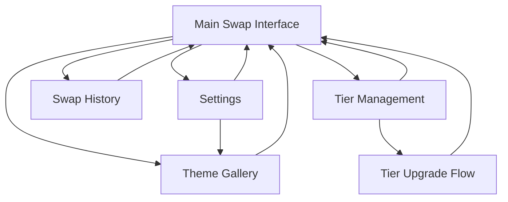

# WAGUS Swap Redesign - Product Requirements Document

## 1. Product Overview
Redesign the WAGUS swap feature to include comprehensive theming capabilities and tier-based fee discount system, elevating the user experience to professional standards comparable to Jupiter.ag and Coinbase.

The redesigned swap platform will provide seamless theme switching, incentivized tier-based fee structures, and a modern, professional interface that enhances user engagement and encourages premium tier adoption.

## 2. Core Features

### 2.1 User Roles
| Role | Registration Method | Core Permissions |
|------|---------------------|------------------|
| Free User | Wallet connection | Basic swap functionality with standard fees |
| Adventurer Tier | Tier purchase/upgrade | Reduced swap fees, premium themes, priority support |
| Premium Tier | Tier purchase/upgrade | Maximum fee discounts, exclusive themes, advanced features |

### 2.2 Feature Module
Our redesigned WAGUS swap requirements consist of the following main pages:
1. **Main Swap Interface**: Enhanced swap form, theme selector, tier status display, fee calculator with discounts
2. **Theme Gallery**: Theme preview, selection interface, tier-locked themes showcase
3. **Tier Management**: Tier comparison, upgrade options, benefits overview, fee discount calculator
4. **Swap History**: Transaction history, fee savings tracker, performance analytics
5. **Settings**: User preferences, theme customization, notification settings

### 2.3 Page Details
| Page Name | Module Name | Feature description |
|-----------|-------------|---------------------|
| Main Swap Interface | Enhanced Swap Form | Redesigned token selection with improved UX, real-time quote updates, slippage controls, and professional styling |
| Main Swap Interface | Theme Selector | Dropdown/modal theme picker with live preview, tier-based theme availability, smooth theme transitions |
| Main Swap Interface | Tier Status Display | Current tier badge, fee discount indicator, upgrade prompts, savings counter |
| Main Swap Interface | Fee Calculator | Real-time fee calculation with tier discounts, fee breakdown display, savings visualization |
| Theme Gallery | Theme Preview | Grid layout of available themes, hover previews, tier requirement badges, theme descriptions |
| Theme Gallery | Theme Selection | One-click theme application, favorites system, recently used themes |
| Tier Management | Tier Comparison | Side-by-side tier benefits, fee discount percentages, exclusive features highlight |
| Tier Management | Upgrade Interface | Tier purchase flow, payment integration, instant tier activation |
| Swap History | Transaction List | Chronological swap history, filter/search functionality, export options |
| Swap History | Fee Analytics | Total fees paid, savings from tier discounts, monthly/yearly summaries |
| Settings | Theme Preferences | Default theme selection, auto-theme switching, custom theme settings |
| Settings | User Preferences | Notification settings, display preferences, accessibility options |

## 3. Core Process

**Free User Flow:**
User connects wallet → Selects tokens for swap → Views standard fees → Executes swap → Sees tier upgrade suggestions based on potential savings

**Tier Upgrade Flow:**
User views tier benefits → Compares fee savings → Purchases tier upgrade → Gains access to premium themes and reduced fees → Enjoys enhanced swap experience

**Theme Selection Flow:**
User accesses theme selector → Previews available themes (based on tier) → Applies new theme → Interface updates seamlessly → Theme preference saved

## 4. User Interface Design

### 4.1 Design Style
- **Primary Colors**: Deep blue (#1a365d) and electric blue (#3182ce) for professional crypto aesthetic
- **Secondary Colors**: Gradient accents (purple to blue), success green (#38a169), warning amber (#d69e2e)
- **Button Style**: Rounded corners with subtle shadows, gradient backgrounds for CTAs, outlined variants for secondary actions
- **Typography**: Inter font family, 16px base size, bold weights for headings, medium for body text
- **Layout Style**: Card-based design with glassmorphism effects, top navigation with theme selector, responsive grid layouts
- **Icons**: Lucide React icons with custom crypto-specific SVGs, consistent 24px sizing, theme-adaptive colors

### 4.2 Page Design Overview
| Page Name | Module Name | UI Elements |
|-----------|-------------|-------------|
| Main Swap Interface | Enhanced Swap Form | Glassmorphism cards with subtle borders, animated token logos, gradient swap button, real-time loading states |
| Main Swap Interface | Theme Selector | Floating dropdown with theme thumbnails, smooth hover animations, tier badges with gold/silver styling |
| Main Swap Interface | Tier Status Display | Prominent tier badge with glow effects, progress bar for next tier, animated savings counter |
| Theme Gallery | Theme Preview | Masonry grid layout, hover zoom effects, tier requirement overlays, smooth transitions |
| Tier Management | Tier Comparison | Three-column comparison table, highlighted current tier, animated benefit reveals, gradient upgrade buttons |
| Swap History | Transaction List | Clean table design with alternating row colors, status indicators, expandable transaction details |
| Settings | Theme Preferences | Toggle switches with smooth animations, color picker components, preview panels |

### 4.3 Responsiveness
Desktop-first design with mobile-adaptive breakpoints at 768px and 1024px. Touch-optimized interactions for mobile devices with larger tap targets and swipe gestures for theme switching. Progressive enhancement for advanced features on larger screens.